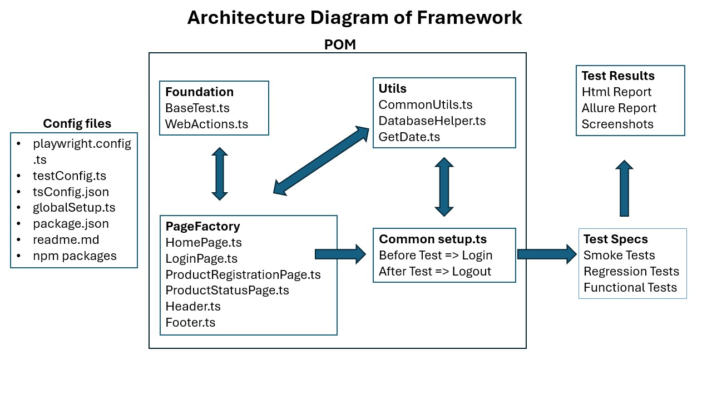

## About the Project

Amaron Battery Testing - This project is a testing framework based on Microsoft Playwright which enables reliable end-to-end testing.

## Getting Started

### Prerequisites

The following software are required:

- nodejs : Download and Install Node JS from
  ```sh
  https://nodejs.org/en/download/
  ```
- Install Java 8 or above, Allure Reports require Java 8 or higher.
- Install Java 11 instead of Java 8 if you intend to use Sonar Qube.
- allure commandline : Install allure command line for generating Allure Reports using
  ```sh
  npm ci -g allure-commandline
  ```

### Installation

1. Install npm packages using:

```sh
npm install
```
2. For running all test cases use command

```sh
npm run test
```
3. For running html repor test use command
```sh
npm run test:report
```

<!-- USAGE EXAMPLES-->

## Usage

1. For Browser Configuration, change required parameters in `playwright.config.ts`.
2. For execution entire test suite on all available browsers simultaneously execute below command where "ENV" can be "qa" or "dev", `Test Cases are present in "tests-specs" folder`.

3. For executing single test case on Chrome browser execute the below command, you can change the browser for execution e.g. if you want to run test cases on Firefox, you can change `--project=Firefox` against `test:single` in `package.json`, just make sure the browser name given matches the name given in `playwright.config.ts`.

4. For executing test cases in parallel, provide a suitable tag `@SmokeTest` at the start of your test case name, then in `package.json` against `test:parallel` give the tag value and execute.

5. For HTML Report generation execute below command , single static HTML report(index.html) which can be sent via email is generated in "html-report" folder

6. For viewing trace files, go to folder where `trace.zip` is generated and execute :
```JS
npx playwright show-trace trace.zip
```
7. In `tsconfig.json` file in `paths` section we can re-assign the long path imports like '../../' to a variable which starts with '@' and then we can use it to shorten our import statements in respective file.
In the below example wherever '../../pageFactory/pageRepository/' import statement is used we can replace it with '@pages'
```JS
"@pages/*":["pageFactory/pageRepository/*"]
```

## High Level Architecture Diagram Of Framework



